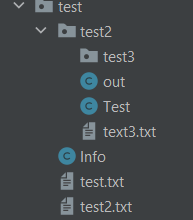
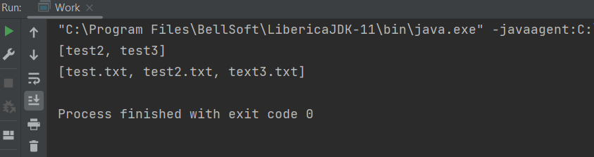
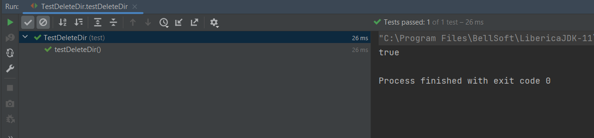

# Работа с файлами в Java 2

### Первая задача

В первой задаче нужно написать коментарии к коду.

* В этой задачи создается список в, котором хранятся элементы каталогов.
* Потом мы открываем цикл и ставим значения до какого уровня мы хотим посмотреть наш основной каталог.
* Создаем массив в который мы положили элементы каталога определенного уровня.
* Чистим наш список, и потом заходим в цикл, проходим через все элементы каталога.
* Проверяем если элемент каталога подкаталог, то элементы этого подкаталога добавляем в наш список (Этот список для следующего уровня).

---------------------

### Вторая задача

Во второй задаче нужно создать функцию, которая в параметрах принимает путь каталогу, расширение файла, и флажок.
И эта функция возвращает список списков, список всех файлов с заданным расширением в заданном каталоге
(включая файлы из его подкаталогов одного уровня вложенности, если флажок = true
, и список всех подкаталогов в заданном каталоге (включая подкаталоги одного уровня вложенности, если флажок = true)

#### Решение

Создаем функцию которая в параметрах принимает путь каталогу, расширение файла, и флажок. Для начало создаем список для хранения элментов каталога.
Потом создаем список для хранения файлов, и создаем список для хранения каталогов. После этого добвляем элементы каталога в список expand.
Открываем цикл, и устанавлиаем до какого уровня посмотреть наш каталог. Создаем массив элементов каталога. Удаляем элементы списка expand.
Открываем цикл, и проходим по массиву, если элемент каталога подкаталог добавляем в список сам каталог, и элементы этого подкаталога добавляем в список expand
(это пригодится для просмотра следующего уровня). А если элемент каталога файл, и расширение этого файла совпадает с расширением переданным в параметры, то кладем его в список.
После прохождения массива смотрим какое значение имеет флажок, если True то просматриваем еще уровни каталога, если False то выходим из цикла.
И под конец создаем список списков, и добавляем в него список каталогов, и добавляем список файлов.

#### Результат работы программы

Директория которая передается программе

Вывод

-------

### Третья задача

В третей задачи нужно написать функцию которая должна удалять заданный каталог, если в каталоге есть файлы, то файлы тоже нужно удалить,
если в каталоге есть подкаталог, делать нечего ненадо. Функция возвращает true если каталог удален, если нет false.

#### Решение

Сначала проверяем существует ли такой каталог, если да то создаем массив элементов нашего каталога, проходим его с помощью foreach и проверяем 
нет ли в каталоге подкаталогов, если есть выходим из функции значением false, если нет дальше идем. Так как в java нельзя удалить каталог если в нем 
есть элементы. Поэтому мы заново проходим через массив и удаляем файлы каталога, и под конец удаляем сам каталог. Функция вернет true при успехе. 

#### Проверка, что файл удалился

